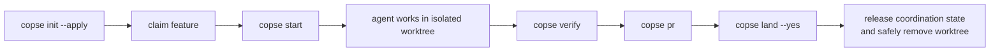

<h1></h1>

Many agent sessions, one repository, no collisions.

[](./LICENSE)
[](https://github.com/AaronLPS/copse/actions/workflows/copse.yml)
[](package.json)
[](package.json)

copse is the repository framework for running Claude Code, Codex, or ordinary
shell-driven feature work in parallel. It gives every feature a deterministic
Git worktree, carries ignored local files such as `.env`, installs shared Git
and agent hooks, records ownership, dependencies, live sessions, and shared
resources, runs one verification path locally and in CI, and closes PR
creation, merge, refresh, and cleanup.

It coordinates mechanics, not product judgment: copse does not choose tasks,
schedule models, or automatically resolve semantic merge conflicts.

## Quickstart

copse requires Node 20 or newer and has no runtime dependencies. It is not yet
published to npm, so run the current repository version directly:

```sh
npx github:AaronLPS/copse init
npx github:AaronLPS/copse init --apply
```

The first command reports what is missing or conflicting. `--apply` creates
only absent wiring, merges copse hooks into existing Codex/Claude settings, and
never overwrites a consumer-owned instruction or workflow file.

For repeated use before the npm release, set the generated runner explicitly:

```json
{
  "runner": ["npx", "--yes", "github:AaronLPS/copse"]
}
```

Then start isolated work:

```sh
copse claim feat/inbox-filter --owner alice --depends-on feat/search-api --resource port:3000
copse start feat/inbox-filter --agent codex --owner alice
# or: copse start feat/inbox-filter --agent claude
# or: copse start feat/inbox-filter -- npm run dev
```

`start` finds or creates the worktree, claims the feature when necessary, and
holds an exclusive process-aware session lease while the command runs. A
second agent cannot enter the same feature worktree; dead processes and expired
heartbeats are reclaimed. A child process cannot change its parent shell's
directory, so this launcher—not a fragile `cd` hook—is the reliable entry point.

## Lifecycle



The main worktree stays on `baseBranch`. Git hooks reject commits and pushes to
protected branches and reject illegal feature branch names. Repository-local
Codex and Claude Code hooks add worktree context at session start and reject
feature edits attempted in the main worktree. CI and a GitHub ruleset remain
the backstop when agent hooks are disabled or untrusted.

## Commands

```text
copse init [--apply] [--ci mode]     inspect/apply repository wiring
copse new <branch>                   create a worktree and carry local files
copse start <branch> [--agent name]  create/find it and launch an agent
copse claim <branch> [options]       record owner and dependencies
copse release <branch>               mark a dependency released
copse list [--json]                  worktrees, PRs, ownership and blockers
copse verify                         doctor, then configured argv checks
copse pr [branch] [--draft]          verify and create a pull request
copse land [branch] [--yes]          gate, merge and safely clean up
copse drop <branch>                  remove only when nothing can be lost
copse doctor                         validate wiring and worktree state
copse protect [--apply]              preview/apply the GitHub ruleset
copse hook <event>                   internal forward target
```

See [the command reference](docs/commands.md) for preconditions, dry-run
behavior, and recovery paths.

## Configuration

`copse.config.json` declares facts and argv arrays; configured commands never
go through a shell.

```json
{
  "baseBranch": "main",
  "releaseBranch": null,
  "branchPrefixes": ["feat", "fix", "docs", "chore"],
  "carryFiles": [".env.test"],
  "carryDirs": ["supabase/.temp"],
  "install": ["pnpm", "install"],
  "verify": [["pnpm", "test"], ["pnpm", "lint"]],
  "agents": {
    "codex": ["codex"],
    "claude": ["claude"]
  },
  "coordinationFile": ".copse/features.json",
  "coordinationBackend": "local",
  "leaseTimeoutSeconds": 300,
  "leaseHeartbeatSeconds": 30,
  "resources": { "feat/inbox-filter": ["port:3000"] },
  "ciMode": "auto",
  "ciSetup": [],
  "runner": ["npx", "--yes", "copse"]
}
```

All defaults and validation rules are in
[the configuration reference](docs/configuration.md).

## Agent integration and trust

`init --apply` writes forwards in `.codex/hooks.json`,
`.claude/settings.json`, `AGENTS.md`, and `CLAUDE.md`. Codex requires review of
new or changed non-managed project hooks; use `/hooks` to inspect and trust
them. Claude Code exposes its project hooks through its own `/hooks` browser.
The generated commands delegate to the configured `runner`, so upgrades live
in the package rather than copied hook implementations.

By default live ownership, leases, and resources are stored in Git's common directory at
`.git/copse/features.json`, immediately visible from all worktrees without
dirtying a branch. `coordinationBackend: "committed"` instead writes the
configured reviewed file for cross-machine synchronization. The committed seed
initializes local state in a fresh clone.

For resources named `port:<number>`, `copse list` and `copse doctor` also show
the listening process PID and working directory when `lsof` is available.

## Development

```sh
npm test                 # unit and real-Git integration tests
npm run check            # syntax-check every module
npm run test:coverage    # coverage report
npm run test:package     # pack, install, and invoke the published artifact
```

The CI matrix runs Node 20, 22, and 24, cancels superseded runs, uses
least-privilege permissions, runs the full local `copse verify` path, records
coverage, and smoke-tests the package. Architecture and contribution rules are
in [CONTRIBUTING.md](CONTRIBUTING.md); the trust model is in
[SECURITY.md](SECURITY.md).
