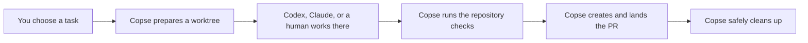
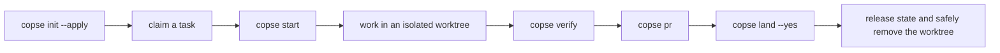

<h1></h1>

Many agent sessions, one repository, no collisions.

[](./LICENSE)
[](https://github.com/AaronLPS/copse/actions/workflows/copse.yml)
[](package.json)
[](package.json)

Copse helps several coding agents—or agents and humans—work on the same Git
repository at the same time without stepping on each other.

It does **not** replace Git, Codex, or Claude Code. It gives all of them the
same safe way to start work, run checks, merge, and clean up.

## The simple idea

Imagine your repository is a shared box of LEGO.

If three builders reach into the same box and change the same model, pieces get
lost and nobody knows whose version is correct. A Git worktree gives each
builder a separate table. That is a good start, but someone still has to:

- label every table;
- copy over local supplies such as `.env` files;
- stop two builders from using the same table or development port;
- remember which build depends on another build;
- run the right checks before calling the work finished;
- merge the finished build and clean the table without throwing away pieces.

Copse is the table manager. It creates and labels the tables, keeps track of
who is using them, applies the same rules to every builder, and cleans up only
when the work is safe.



## Why would I use it?

Copse is useful when you want to run more than one coding session at once, or
when your team mixes Codex, Claude Code, and normal terminal work.

Without a shared workflow, every tool can create branches and worktrees in a
slightly different way. The isolation may be fine, but ownership, local files,
ports, verification, merging, and cleanup are still conventions that people
and agents must remember.

With Copse, the repository remembers those conventions for everyone.

## What Copse adds

### Compared with plain `git worktree`

Git gives you separate folders and branches. Copse builds a guarded workflow
on top:

| Plain Git worktree | What Copse adds |
| --- | --- |
| You choose the path and branch | Deterministic names and allowed branch prefixes |
| Ignored files stay behind | Declared local files and directories are carried safely |
| Anyone can open the same worktree | Exclusive, process-aware session leases |
| Coordination lives in people's heads | Owners, dependencies, status, and shared resources |
| Setup is manual | An optional install command runs when the worktree is created |
| Tests are whatever someone remembers | One configured `verify` path locally and in CI |
| PR, merge, and cleanup are separate chores | Guarded `pr`, `land`, and `drop` commands |
| Removing a worktree can lose local-only files | Cleanup refuses unsafe removal and rescues carried files |

### Compared with the default agent workflow

Codex and Claude Code are the builders: they understand code, edit files, run
commands, and help prepare changes. Copse manages the repository around them.

| Workflow | Good at by itself | What Copse adds |
| --- | --- | --- |
| Codex CLI | Working with code from a terminal | A prepared worktree, repository-enforced branch rules, shared coordination, and the same finish path used by other tools |
| Codex Desktop | Running and reviewing coding tasks in a visual app | A tool-independent contract that also applies to CLI agents, humans, Git hooks, and CI |
| Claude Code | Coding sessions, subagents, and built-in worktree isolation | Cross-tool ownership, dependency and resource tracking, shared verification, and guarded landing |
| A human with Git | Maximum flexibility and familiar commands | Automation for the repetitive safety checks people otherwise need to remember |

This is not a claim that those tools cannot use worktrees. Codex workflows can
run tasks in isolated checkouts, and Claude Code supports `--worktree` plus
`.worktreeinclude`. The difference is scope: their defaults manage an agent
session; Copse manages a repository lifecycle shared by different tools.

Copse also does not choose tasks, schedule models, or automatically resolve a
semantic merge conflict. Those still require product and engineering judgment.

## Five-minute start

### 1. Add Copse to a repository

You need Node.js 20 or newer. From the repository root, run:

```sh
npx github:AaronLPS/copse init --apply \
  --runner-package github:AaronLPS/copse
```

This wires Copse into the repository and stores the runner that hooks and CI
should use. It creates only missing wiring, merges Copse hooks into existing
Codex and Claude settings, and does not overwrite files owned by the project.

Want to see what would change first? Omit `--apply`.

For production use, pin a reviewed commit or release instead of following a
moving GitHub branch. For example:

```sh
npx @aaronlps/copse@0.4.1 init --apply \
  --runner-package @aaronlps/copse@0.4.1
```

The examples below use the short `copse` command. If it is not installed on
your `PATH`, invoke the pinned package with `npx --yes <package-spec>` instead,
or expose the configured runner through your package scripts.

### 2. Start one task

```sh
copse start feat/inbox-filter --agent codex
```

Or use Claude Code:

```sh
copse start feat/inbox-filter --agent claude
```

Or run an ordinary command in the same managed worktree:

```sh
copse start feat/inbox-filter -- npm run dev
```

`start` creates or finds the task's worktree, records an owner, takes an
exclusive lease, and launches the selected command inside it. While that
process is alive, another session cannot accidentally enter the same task.

### 3. Check the work

From the feature worktree:

```sh
copse verify
```

This runs `copse doctor` and then the repository's configured test, lint, or
build commands. CI uses the same path, so “works locally” and “works in CI” are
less likely to mean different things.

### 4. Open and land the pull request

Commit and push the finished feature branch as usual, then run:

```sh
copse pr
copse land --yes
```

Copse deliberately does not invent commits or push unreviewed work for you.
`pr` requires a clean, pushed feature branch and verifies it before creating
its pull request. `land` checks the worktree, pull request, CI, and dependencies
before merging and cleaning up.

If you only want to inspect whether landing is safe, omit `--yes`.

## Using Codex Desktop with Copse

Use Copse to prepare and protect the workspace; use Codex Desktop to talk to
the agent, inspect its diff, and run your normal visual development workflow.
The one important rule is simple: open the **Copse feature worktree**, not the
repository's main checkout.

### 1. Prepare a Desktop task

From the main repository folder, start a managed shell for the task:

```sh
copse start docs/refresh-readme -- bash
```

Copse prints a path such as `/projects/my-app-docs-refresh-readme` and opens a
shell there. Keep that terminal open while the Desktop task is running: it is
the task's lease, so a second session cannot accidentally take the same work.

### 2. Open that exact folder in Codex Desktop

In Codex Desktop, create or open a **local** task for the feature-worktree path
Copse printed. Give Codex the task as you normally would. Do not select the
main repository folder.

After `copse init --apply`, the project hook configuration is already in that
worktree. It tells Codex which branch and worktree it is using, and prevents
feature edits from being made in the protected main checkout.

### 3. Work and review in the app

Use Desktop normally: ask Codex to make the change, inspect its diff, run the
app or tests, and steer the task. Copse does not change the Desktop experience;
it makes the Git workspace around that task predictable and shared with anyone
using the CLI or another agent.

### 4. Verify and finish from the terminal

Return to the terminal that Copse opened. It is already in the feature
worktree:

```sh
copse verify
```

Commit and push the reviewed change, then use `copse pr` and `copse land --yes`
as described above. When you are finished with the Desktop task, leave the
managed shell with `exit`; Copse releases its session lease.

`copse start docs/refresh-readme --agent codex` is still useful, but it starts
the Codex **CLI**. Use the `-- bash` form when Codex Desktop is the agent you
want to use.

## Working on dependent tasks

Suppose the inbox filter needs a search API that another session is building:

```sh
copse claim feat/search-api --owner bob
copse claim feat/inbox-filter --owner alice \
  --depends-on feat/search-api \
  --resource port:3000

copse start feat/search-api --agent claude --owner bob
copse start feat/inbox-filter --agent codex --owner alice
```

Now Copse can show who owns each task, prevent conflicting use of `port:3000`,
and block the dependent task from landing too early.

```sh
copse list
copse release feat/search-api
```

Dead launcher processes and expired heartbeats are reclaimed, so an abandoned
lease does not block the repository forever.

## The lifecycle



The main worktree stays on the configured base branch. Git hooks reject commits
and pushes to protected branches and reject illegal feature branch names.
Repository-local Codex and Claude Code hooks add worktree context when a session
starts and reject feature edits attempted in the main worktree. CI and a GitHub
ruleset provide a backstop when agent hooks are disabled or untrusted.

## Command cheat sheet

```text
copse init [--apply] [--ci mode] [--runner-package spec]
                                      preview or apply repository wiring
copse new <branch>                    create a worktree and carry local files
copse start <branch> [--agent name]   create/find it and launch an agent
copse claim <branch> [options]        record owner, dependencies, and resources
copse release <branch>                mark a dependency released
copse list [--json]                   show worktrees, PRs, owners, and blockers
copse verify                          diagnose the setup, then run checks
copse pr [branch] [--draft]           verify and create a pull request
copse land [branch] [--yes]           gate, merge, and safely clean up
copse drop <branch>                   remove only when nothing can be lost
copse doctor                          validate wiring and worktree state
copse protect [--apply]               preview or apply the GitHub ruleset
copse hook <event>                    internal hook target
```

See the [command reference](docs/commands.md) for preconditions, preview
behavior, and recovery instructions.

## Configuration

`copse.config.json` is the repository's shared rulebook. Commands are stored as
argument arrays and are never passed through a shell.

```json
{
  "baseBranch": "main",
  "releaseBranch": null,
  "branchPrefixes": ["feat", "fix", "docs", "chore"],
  "carryFiles": [".env.test"],
  "carryDirs": ["supabase/.temp"],
  "install": ["pnpm", "install"],
  "verify": [["pnpm", "test"], ["pnpm", "lint"]],
  "agents": {
    "codex": ["codex"],
    "claude": ["claude"]
  },
  "coordinationFile": ".copse/features.json",
  "coordinationBackend": "local",
  "leaseTimeoutSeconds": 300,
  "leaseHeartbeatSeconds": 30,
  "resources": { "feat/inbox-filter": ["port:3000"] },
  "ciMode": "auto",
  "ciSetup": [],
  "runner": ["npx", "--yes", "@aaronlps/copse"]
}
```

See the [configuration reference](docs/configuration.md) for every default and
validation rule.

## Agent integration and trust

`init --apply` writes small forwarding configurations in `.codex/hooks.json`,
`.claude/settings.json`, `AGENTS.md`, and `CLAUDE.md`. Codex asks you to review
new or changed project hooks; use `/hooks` to inspect them. Claude Code exposes
project hooks through its own `/hooks` browser. The forwards call the configured
runner, so upgrades happen in the package instead of copied hook code.

Git hook wrappers live in `.copse/hooks`. During onboarding, Copse remembers
the previous active hook path in clone-local `copse.previousHooksPath` and runs
that hook after Copse policy succeeds. Existing Husky or custom hook files are
not edited.

By default, live ownership, leases, and resources live in Git's common
directory at `.git/copse/features.json`. Every worktree sees that state
immediately, but it does not dirty a branch. Set `coordinationBackend` to
`"committed"` when the coordination file must be reviewed and synchronized
across machines.

For resources named `port:<number>`, `copse list` and `copse doctor` can also
show the listening process ID and working directory when `lsof` is available.

Read [SECURITY.md](SECURITY.md) for the complete trust model.

## Developing Copse

```sh
npm test                 # unit and real-Git integration tests
npm run check            # syntax-check every module
npm run test:coverage    # create a coverage report
npm run test:package     # packed consumer and two-agent acceptance test
```

The package acceptance test launches fixture `codex` and `claude` commands in
two concurrent feature worktrees. It tests isolation and leases without vendor
authentication or quota.

Authenticated vendor acceptance is deliberately opt-in and never runs during
ordinary `copse verify`:

```sh
COPSE_LIVE_AGENT_TEST=1 \
COPSE_CODEX_COMMAND='["codex"]' \
COPSE_CLAUDE_COMMAND='["claude"]' \
npm run test:agents:live
```

That command can consume Codex and Claude quota. Each command variable must be
a non-empty JSON argument array, and you should review both vendors' project
hook trust prompts.

CI tests Node.js 20, 22, and 24, cancels superseded runs, uses least-privilege
permissions, runs the full local `copse verify` path, records coverage, and
smoke-tests the package. Architecture and contribution rules are in
[CONTRIBUTING.md](CONTRIBUTING.md).
