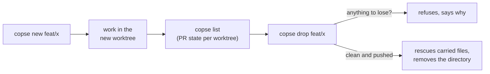

<h1></h1>

Many agent sessions, one repository, no collisions.

[](./LICENSE)
[](https://github.com/AaronLPS/copse/actions/workflows/test.yml)
[](package.json)
[](package.json)

## Why

One person, several coding-agent sessions — Claude Code, Codex, or a mix —
against the same checkout. Left alone, they collide: two sessions editing
the same working tree stomp each other's uncommitted changes, and a
hand-made `git worktree add` silently drops gitignored files like `.env`,
so the new worktree fails at runtime in a way that looks like a code
problem.

copse gives each session its own git worktree, named after its branch, with
those gitignored files copied over. It does not schedule agents, does not
decide what they work on, and does not merge anything on their behalf — it
manages the directories.



## Quickstart

copse is zero-dependency and requires Node ≥20. It is **not** on npm yet;
until then, run it straight from the repository:

```
npx github:AaronLPS/copse <command>
```

(or from a checkout: `node /path/to/copse/src/cli.mjs`, or `npm link`.)

A real run, from a throwaway repository:

```
$ npx github:AaronLPS/copse new feat/inbox-filter
→ fetching, so origin/main is current
→ /home/me/ws/proj-feat-inbox-filter  (feat/inbox-filter from origin/main)
→ copying the files git will not carry
   ✓ .env.test

✓ /home/me/ws/proj-feat-inbox-filter
  cd /home/me/ws/proj-feat-inbox-filter
```

## Commands

```
copse new <prefix>/<lower-kebab>   create a worktree, branch, and carry the ignored files
copse list                         every worktree, and whether its directory name still fits
copse drop <branch>                remove a worktree, refusing while anything would be lost
copse doctor                       is the carried-file declaration and every worktree name still true
```

Full behavior — `new`'s refusals, `list`'s drift and PR states, `drop`'s
refuse-then-rescue sequence, `doctor`'s exit codes — is in
[`docs/commands.md`](docs/commands.md).

## Configuration

One optional `copse.config.json` at the repository root; every key has a
default, so no config file is needed to start.

```json
{
  "baseBranch": "main",
  "carryFiles": [".env.test"],
  "carryDirs": ["supabase/.temp"],
  "install": ["pnpm", "install"]
}
```

All keys, their validation rules, and the branch-name/directory-name scheme
are in [`docs/configuration.md`](docs/configuration.md).

`install` runs a command from the repository's config with no prompt — the
same trust boundary as `npm install` lifecycle scripts. The full trust
model is in [`SECURITY.md`](SECURITY.md).

## Status

This is the first slice of a larger design (see
[`docs/DESIGN.md`](docs/DESIGN.md)); this README describes only what is
implemented and tested today. `copse init`, `land`, `verify`, `protect`,
and `hook` are designed but not built — running one just prints the usage
text.

## More

- [`docs/commands.md`](docs/commands.md) — full command reference and debugging.
- [`docs/configuration.md`](docs/configuration.md) — config keys and naming rules.
- [`CONTRIBUTING.md`](CONTRIBUTING.md) — how the test suite and the
  architecture rule work, before sending a pull request.
- [`SECURITY.md`](SECURITY.md) — copse's trust boundary and how to report
  a vulnerability.
- [`CODE_OF_CONDUCT.md`](CODE_OF_CONDUCT.md) — the standard this project
  holds itself to.
