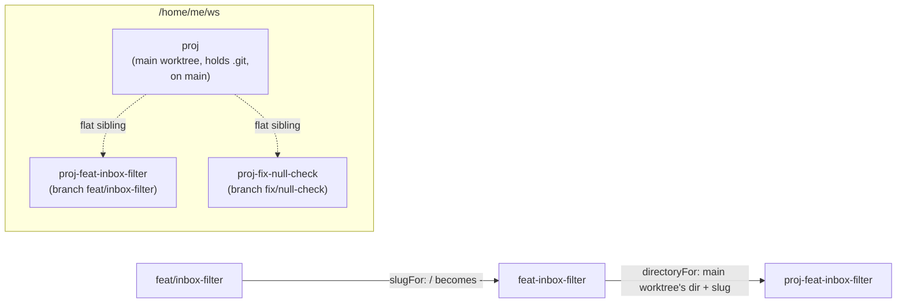

# Configuration

## `copse.config.json`

One optional file at the repository root. Every key has a default, so a
repository with no config file works with `baseBranch: "main"` and no
carried paths.

| key | default | validation |
| --- | --- | --- |
| `baseBranch` | `"main"` | non-empty string |
| `branchPrefixes` | `["feat", "fix", "docs", "chore"]` | non-empty array; each entry lower-case letters/digits starting with a letter; **no hyphens** |
| `carryFiles` | `[]` | array of repo-relative paths |
| `carryDirs` | `[]` | array of repo-relative paths; may not overlap `carryFiles` |
| `install` | `null` | `null`, or a non-empty array of non-empty strings |

An unknown top-level key is refused too — almost always a typo, and a typo
that is silently ignored looks exactly like a setting that doesn't work.
Every violation is collected and reported together, not just the first.

```json
{
  "baseBranch": "devel",
  "branchPrefixes": ["feat", "fix", "docs", "chore"],
  "carryFiles": [".env.test", "apps/mobile/.env"],
  "carryDirs": ["supabase/.temp"],
  "install": ["pnpm", "install"]
}
```

Two of these rules protect invariants that fail far from their cause if
ever violated, so both are checked at config load rather than left to be
discovered later:

- **A hyphen in a branch prefix is refused.** The slug that names a
  worktree's directory is built by replacing the branch's `/` with `-`
  (`feat/inbox-filter` → `feat-inbox-filter`); recovering the branch from
  that slug means splitting at the first `-`. A prefix containing a hyphen
  makes that split ambiguous, and the symptom is a worktree nobody can find
  by name.
- **A carried path is refused if it is absolute, contains a `..` segment,
  contains a backslash, or (checked at copy time, not config-parse time)
  resolves outside the repository through a symlink.** copse copies these
  paths into and out of worktree directories on your behalf; any of those
  four is a way to make that copy land somewhere other than where it looks
  like it lands. The backslash check exists because a `/`-only segment
  check can be walked around with a Windows-style separator on a platform
  that still honours it.

`install` is always an array, never a string — copse hands it to
`execFileSync` element by element, so nothing in it can be interpreted by a
shell. It runs with inherited stdio and no confirmation prompt, on the same
trust boundary as `npm install`'s lifecycle scripts; see
[`SECURITY.md`](../SECURITY.md) for the full trust model.

## Branch names and directory names

A branch must be `<prefix>/<lower-kebab>`, with exactly one slash, where
`<prefix>` is one of `branchPrefixes`: for example `feat/inbox-filter`,
`fix/null-check`. Two slashes, upper case, underscores, and a doubled or
trailing hyphen are all refused.

The directory a worktree gets is derived from the branch, never chosen: the
`/` becomes a `-`, and the whole slug is appended as a suffix to the main
worktree's own directory, as a flat sibling of it — not nested inside it.



The prefix is kept in the slug rather than stripped. Stripping it would read
better (`proj-inbox-filter`) but would break the round trip: `feat/foo` and
`fix/foo` would then want the same directory. Flat siblings, rather than a
nested container, exist because a worktree at a different depth resolves
any relative path reference differently than the main worktree does — a
failure that shows up in only *some* worktrees, which is a hard shape to
recognise.
